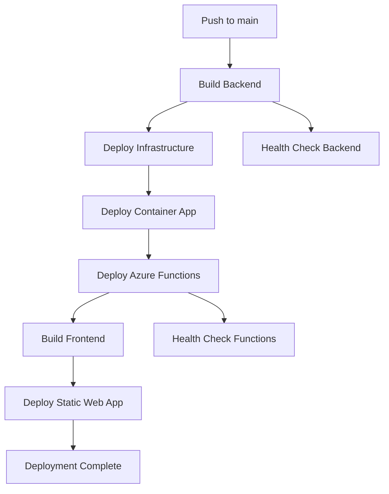

# CI/CD Pipeline Overview

This document describes the automated deployment pipeline for the marketplace application.

## 🚀 Pipeline Trigger

The pipeline runs automatically when:
- Code is pushed to the `main` branch
- Manual trigger via GitHub Actions UI

## 📋 Pipeline Jobs

### 1. **build-and-deploy-backend**
**Duration**: ~5-8 minutes

**Steps**:
1. **Build Docker Image**: Creates versioned container image
2. **Push to Registry**: Uploads to Docker Hub
3. **Terraform Init**: Initializes infrastructure state
4. **Import Resources**: Imports existing Azure resources (if any)
5. **Terraform Plan/Apply**: Deploys/updates infrastructure
6. **Deploy Container**: Updates Container App with new image
7. **Health Check**: Verifies backend is running

**Outputs**:
- `backend-url`: Backend API URL for frontend

### 2. **deploy-azure-functions**
**Duration**: ~3-5 minutes
**Depends on**: `build-and-deploy-backend`

**Steps**:
1. **Setup Python**: Installs Python 3.9
2. **Get Function App Name**: Retrieves from Terraform output
3. **Install Dependencies**: Installs Python packages
4. **Deploy Functions**: Deploys Python code to Azure Functions
5. **Health Check**: Tests function endpoints
6. **AI Test**: Tests description generation

**Outputs**:
- `function-url`: Azure Functions URL for frontend

### 3. **build-and-deploy-frontend**
**Duration**: ~2-4 minutes
**Depends on**: `build-and-deploy-backend`, `deploy-azure-functions`

**Steps**:
1. **Setup Node.js**: Installs Node.js 18
2. **Install Dependencies**: Runs `npm ci`
3. **Build Frontend**: Creates production build with API URLs
4. **Deploy to Static Web App**: Uploads to Azure Static Web Apps

## 🔧 Environment Variables

The pipeline uses these GitHub Secrets:

### **Azure Authentication**
- `AZURE_CLIENT_ID`
- `AZURE_CLIENT_SECRET` 
- `AZURE_SUBSCRIPTION_ID`
- `AZURE_TENANT_ID`

### **Application Secrets**
- `DB_PASSWORD`: PostgreSQL admin password
- `GEMINI_API_KEY`: Google Gemini API key
- `CONTENT_SAFETY_KEY`: Azure Content Safety API key
- `AZURE_STORAGE_ACCOUNT_NAME`: Storage account name

### **Docker Registry**
- `DOCKERHUB_USERNAME`
- `DOCKERHUB_TOKEN`

### **Static Web App**
- `AZURE_STATIC_WEB_APPS_API_TOKEN`

## 🏗️ Infrastructure Created

The pipeline creates/manages:

### **Core Infrastructure**
- Resource Group: `rg-marketplace-dev`
- Container App Environment: `cae-marketplace-dev`
- PostgreSQL Server: `psql-marketplace-dev`
- Storage Account: `{storage-name}` (for images)

### **Backend Services**
- Container App: `ca-marketplace-backend-dev`
- Docker Image: `roshh4/marketplace-backend-alpine-amd64:v{date}-{commit}`

### **Azure Functions**
- Function Storage: `{storage-name}func`
- Service Plan: `asp-marketplace-functions-dev`
- Function App: `func-marketplace-ai-dev`

### **Frontend**
- Static Web App: Deployed separately (existing)

## 🔄 Deployment Flow



## 🧪 Testing Strategy

### **Backend Tests**
- Health endpoint check
- Container app status verification
- Database connectivity test

### **Function Tests**
- Health endpoint check
- AI status verification
- Description generation test

### **Integration Tests**
- End-to-end API flow
- Frontend build with correct URLs

## 📊 Monitoring

### **Pipeline Monitoring**
- GitHub Actions logs
- Step-by-step execution status
- Error notifications

### **Application Monitoring**
- Azure Application Insights
- Container App logs
- Function execution logs

## 🚨 Failure Handling

### **Common Failures**
1. **Docker Build Fails**: Check Dockerfile and dependencies
2. **Terraform Fails**: Check Azure permissions and state
3. **Function Deploy Fails**: Check Python dependencies and code
4. **Health Checks Fail**: Check application startup and configuration

### **Recovery Steps**
1. Check GitHub Actions logs for specific error
2. Verify Azure resource status in portal
3. Re-run failed jobs if transient issue
4. Fix code/configuration and push again

## 🔐 Security

### **Secrets Management**
- All sensitive data in GitHub Secrets
- No hardcoded credentials in code
- Terraform state stored securely

### **Access Control**
- Service principal with minimal permissions
- Resource-level access controls
- Network security groups (production)

## 💰 Cost Optimization

### **Development Environment**
- Container Apps: Scale to zero
- Azure Functions: Consumption plan
- PostgreSQL: Basic tier
- Storage: Standard LRS

### **Cost Monitoring**
- Azure Cost Management alerts
- Resource tagging for cost tracking
- Automatic scaling policies

## 🚀 Production Considerations

For production deployment:

1. **Separate Environments**: Use different resource groups
2. **State Management**: Separate Terraform state files
3. **Approval Gates**: Manual approval for production
4. **Blue-Green Deployment**: Zero-downtime deployments
5. **Monitoring**: Enhanced monitoring and alerting
6. **Backup Strategy**: Database and storage backups
7. **Security**: Network isolation and Key Vault integration

## 📝 Pipeline Customization

### **Adding New Services**
1. Add Terraform resources to `main.tf`
2. Add deployment steps to pipeline
3. Update health checks and tests

### **Environment Variables**
1. Add to GitHub Secrets
2. Reference in pipeline YAML
3. Pass to Terraform as variables

### **Custom Deployment Logic**
1. Modify pipeline steps
2. Add custom scripts if needed
3. Update documentation

## 🔍 Troubleshooting

### **Pipeline Debug**
```bash
# Check pipeline status
gh run list

# View specific run logs
gh run view <run-id>

# Re-run failed jobs
gh run rerun <run-id>
```

### **Azure Resource Debug**
```bash
# Check resource status
az resource list --resource-group rg-marketplace-dev

# Check container app logs
az containerapp logs show --name ca-marketplace-backend-dev --resource-group rg-marketplace-dev

# Check function app status
az functionapp show --name func-marketplace-ai-dev --resource-group rg-marketplace-dev
```

This CI/CD pipeline provides a robust, automated deployment process that ensures consistent and reliable deployments across all components of the marketplace application.
