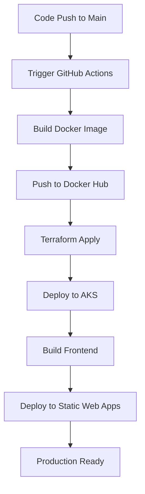
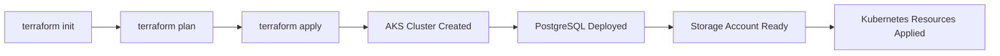
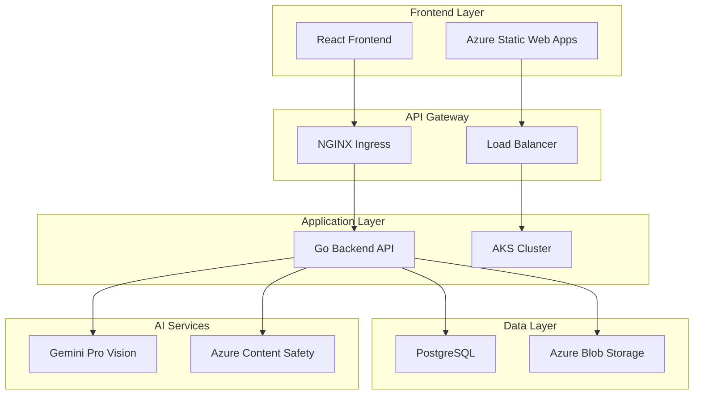

# Cloud-Native Marketplace Platform Documentation

## Project Overview

A comprehensive cloud-native marketplace platform designed for college students, featuring AI-powered product descriptions, content moderation, and automated CI/CD deployment to Azure Kubernetes Service (AKS).

## GitHub Repository

**Repository URL:** [https://github.com/roshh4/marketplacer2v2](https://github.com/roshh4/marketplacer2v2)

### Repository Structure
```
├── backend/          # Go-based REST API server
├── frontend/         # React + TypeScript frontend
├── terraform/        # Infrastructure as Code
├── k8s/             # Kubernetes manifests
├── .github/workflows/ # CI/CD pipeline configuration
└── docs/            # Additional documentation
```

### Key Features
- **Backend:** Go with Gin framework, PostgreSQL database
- **Frontend:** React with TypeScript and Vite
- **AI Integration:** Google Gemini Pro Vision for product descriptions
- **Content Safety:** Azure Content Safety API for image moderation
- **Infrastructure:** Azure Kubernetes Service (AKS) with Terraform
- **Storage:** Azure Blob Storage for product images
- **CI/CD:** GitHub Actions with automated deployments

## CI/CD Pipeline Architecture

### Pipeline Overview
The project implements a sophisticated CI/CD pipeline using GitHub Actions that automates the entire deployment process from code commit to production deployment.

### Pipeline Components

#### 1. **Build and Deploy Backend**
- **Docker Image Build:** Creates optimized Alpine-based container images
- **Version Tagging:** Generates unique tags using timestamp and commit hash
- **Image Registry:** Pushes to Docker Hub with versioned tags
- **Infrastructure Provisioning:** Terraform manages Azure resources
- **Kubernetes Deployment:** Automated deployment to AKS cluster

#### 2. **Build and Deploy Frontend**
- **Static Site Generation:** Builds optimized React application
- **Environment Configuration:** Injects backend API URLs
- **Azure Static Web Apps:** Deploys to Azure's global CDN

### Pipeline Workflow



### Key Pipeline Features
- **Zero-Downtime Deployments:** Rolling updates with health checks
- **Version Control:** Each deployment gets unique version tags
- **Infrastructure as Code:** All resources managed through Terraform
- **Automated Testing:** Health checks and deployment verification
- **Rollback Capability:** Easy rollback to previous versions

## Terraform Infrastructure Flow

### Infrastructure Components

#### 1. **Azure Kubernetes Service (AKS)**
```hcl
resource "azurerm_kubernetes_cluster" "marketplace" {
  name                = "aks-marketplace-dev"
  kubernetes_version  = "1.30.14"
  sku_tier           = "Premium"
  
  default_node_pool {
    name       = "default"
    node_count = 1
    vm_size    = "Standard_B2s"
  }
}
```

#### 2. **PostgreSQL Flexible Server**
```hcl
resource "azurerm_postgresql_flexible_server" "marketplace" {
  name     = "psql-marketplace-dev"
  version  = "13"
  sku_name = "B_Standard_B1ms"
  storage_mb = 32768
}
```

#### 3. **Azure Storage Account**
```hcl
resource "azurerm_storage_account" "marketplace_storage" {
  name                     = "marketplacestore2024"
  account_tier            = "Standard"
  account_replication_type = "LRS"
  account_kind            = "StorageV2"
}
```

### Terraform Deployment Flow



### Infrastructure Benefits
- **Scalability:** Auto-scaling capabilities with AKS
- **High Availability:** Multi-zone deployment support
- **Cost Optimization:** Right-sized resources for development
- **Security:** Network policies and SSL encryption
- **Monitoring:** Built-in Azure monitoring and logging

## AI-Powered Features

### 1. **Content Moderation System**

#### Implementation Details
- **Service:** Azure Content Safety API
- **Endpoint:** `https://image-content-moderation.services.ai.azure.com`
- **API Version:** 2024-09-01
- **Categories:** Hate, SelfHarm, Sexual, Violence

#### Content Safety Flow
```go
func CheckImageSafety(imageBytes []byte) (bool, error) {
    // Convert image to base64
    imageBase64 := base64.StdEncoding.EncodeToString(imageBytes)
    
    // Analyze with Azure Content Safety
    request := ContentSafetyRequest{
        Categories: []string{"Hate", "SelfHarm", "Sexual", "Violence"},
        OutputType: "FourSeverityLevels",
    }
    
    // Process and evaluate safety scores
    // Reject images with severity >= 3
}
```

#### Safety Levels
- **Level 0:** Safe content
- **Level 1:** Low risk
- **Level 2:** Medium risk  
- **Level 3:** High risk (Rejected)
- **Level 4:** Very high risk (Rejected)

### 2. **AI Product Description Generation**

#### Implementation Details
- **Service:** Google Gemini Pro Vision API
- **Model:** gemini-pro-vision
- **Endpoint:** `https://generativelanguage.googleapis.com/v1beta/models`
- **Fallback:** Template-based generation

#### Description Generation Flow
```go
func GenerateDescriptionWithFiles(c *gin.Context) {
    // 1. Parse uploaded images
    // 2. Save to temporary storage
    // 3. Call Gemini Pro Vision API
    // 4. Generate compelling descriptions
    // 5. Clean up temporary files
}
```

#### Features
- **Multi-modal Analysis:** Combines image analysis with text inputs
- **Context-Aware:** Tailored for college marketplace audience
- **Fallback System:** Template generation if API unavailable
- **Performance Optimized:** Concurrent processing and caching

## Screenshots Documentation

### Azure Container Registry (ACR)
*[Screenshot Location: Include screenshot showing:]*
- Container images with version tags
- Repository structure
- Image vulnerability scanning results
- Access policies and authentication settings

### Azure Kubernetes Service (AKS)
*[Screenshot Location: Include screenshots showing:]*
- **Cluster Overview:** Node pools, Kubernetes version, resource utilization
- **Workloads:** Running pods, deployments, services status
- **Networking:** Ingress controllers, load balancers, DNS configuration
- **Monitoring:** Performance metrics, logs, health status

### Content Moderation in Action
*[Screenshot Location: Include screenshots showing:]*
- **API Testing:** PowerShell script execution with base64 conversion
- **Safety Analysis:** Detailed category analysis with severity levels
- **Rejection Examples:** Images blocked due to inappropriate content
- **Approval Process:** Safe images passing through moderation

### AI Description Generation
*[Screenshot Location: Include screenshots showing:]*
- **API Integration:** Gemini Pro Vision API calls
- **Multi-modal Input:** Image upload with title and category
- **Generated Output:** AI-generated product descriptions
- **Performance Metrics:** Response times and model usage statistics

## Technical Architecture

### System Architecture Diagram


### Security Implementation
- **Authentication:** JWT-based user authentication
- **Authorization:** Role-based access control
- **Data Encryption:** SSL/TLS for all communications
- **Content Filtering:** AI-powered content moderation
- **Network Security:** Kubernetes network policies

### Performance Optimizations
- **Caching:** Redis for session and API response caching
- **CDN:** Azure Static Web Apps global distribution
- **Database:** Connection pooling and query optimization
- **Images:** Automatic compression and format optimization

## Deployment Guide

### Prerequisites
- Azure CLI configured
- kubectl installed
- Terraform >= 1.6.0
- Docker for local development

### Environment Setup
```bash
# Set required environment variables
export TF_VAR_db_admin_password="secure-password"
export TF_VAR_storage_account_name="unique-storage-name"

# Deploy infrastructure
cd terraform
terraform init
terraform plan
terraform apply
```

### Kubernetes Deployment
```bash
# Get AKS credentials
az aks get-credentials --resource-group rg-marketplace-dev --name aks-marketplace-dev

# Deploy application
kubectl apply -f k8s/
kubectl rollout status deployment/marketplace-backend -n marketplace
```

## Monitoring and Maintenance

### Health Monitoring
- **Application Health:** `/health` endpoint monitoring
- **Infrastructure Monitoring:** Azure Monitor integration
- **Performance Metrics:** Response times, error rates, throughput
- **Cost Monitoring:** Resource usage and cost optimization

### Maintenance Procedures
- **Updates:** Rolling deployments with zero downtime
- **Backups:** Automated database and storage backups
- **Scaling:** Horizontal pod autoscaling based on metrics
- **Security:** Regular security updates and vulnerability scanning

## Conclusion

This cloud-native marketplace platform demonstrates modern DevOps practices, AI integration, and scalable architecture design. The implementation showcases:

- **Automated CI/CD** with GitHub Actions
- **Infrastructure as Code** with Terraform
- **Container Orchestration** with Kubernetes
- **AI-Powered Features** for enhanced user experience
- **Enterprise-Grade Security** with content moderation
- **Scalable Architecture** ready for production workloads

The platform serves as a comprehensive example of cloud-native application development, suitable for educational purposes and real-world deployment scenarios.
